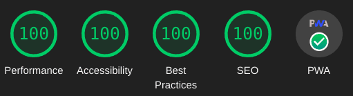

+++
title = "Resumen del sitio web"
description = "Luis-TI.dev.br es un sitio web rápido y ligero hecho con Zola usando html semántico, un tema CSS abridge de clase-liavana, y JS No Mandatorio."
date = 2024-11-02T15:00:00Z
updated = 2024-11-02T15:00:00Z
draft = false

[taxonomies]
tags = ["Resumen"]
[extra]
toc = true
+++

{{ m00main() }}

Un sitio web estático rápido, liviano e multi-lenguaje usando [Zola](https://getzola.org) y el tema [Abridge](https://github.com/Jieiku/abridge). Con puntuación perfecta en: [Lighthouse](https://pagespeed.web.dev/report?url=luis-ti.dev.br) (Google), [YellowLabTools](https://yellowlab.tools/) (herramienta de Código Abierto), y [Observatory](https://developer.mozilla.org/en-US/observatory/analyze?host=luis-ti.dev.br) (Mozilla). Aquí puedes ver una imagen de mi puntuación de Google Lighthouse.
<!-- more -->

Esto es posible usando HTML semántico, CSS y JavaScript No Mandatorio. Alias esta site conta com suporte PWA, você pode descarregar e instalar o site como um aplicativo local, disponível com Google Chrome. Melhores práticas de accessivilidade e outros beneficios. Aquí há uma lista extendida com mais características y detalhes do que posso ofereçer para seu site.

## Características

- Pontuação perfeita de [Lighthouse](https://pagespeed.web.dev/report?url=luis-ti.dev.br), [YellowLabTools](https://yellowlab.tools/), e [Observatory](https://developer.mozilla.org/en-US/observatory/analyze?host=luis-ti.dev.br).
- [Suporte PWA](#pwa-progressive-web-app) (Aplicativo Web Progressivo) para um Site Totalmente Offlline com suporte de busqueda completo.
- [Escuro, Claro, Auto, e Switcher themes](#dark-or-light-themes).
- Suporte para Multi-linguagem.
- Suporte de búsqueda.
- [Sugestões de búsqueda](#search-suggestions), com teclas de navegação e Página de Resultados de busqueda.
- Suporte [SEO](#seo-and-header-tags) (Otimização para Motores de Búsqueda).
- [Paginação](#pagination) com paginador numerado no índice.
- Links Título Baseado no Artigo Previo ou Próximo embaixo do Artigo.
- Tabua de Conteúdo em Indice de página (com links  clickavel).
- Bloco com Postagens Recentes.
- Botão Voltar ao Topo.
- Email link no rodapé com obfuscação para anti-spam.
- [Página de Archivo](https://luis-ti.dev.br/archivo/).
- [Etiquetas](https://luis-ti.dev.br/tags/).
- Categorias. Similar às Etiquetas pero para páginas complexa com muitas secções. Eu não estou usando.
- Icones Links das Redes Sociais no rodapé.
- Desenho Responsivo (primeiro movile).
- Video Shortcodes* para conteúdo embutido do Youtube, Vimeo or Streamable.
- Outros Media Shortcodes para videos, imagens e audio para uma página web rica em conteúdo.
- Outros Shortcodes para mostrar dados, se você precisar.

Por ahora deixo uma descrição curta de algumas de estas características e funcionalidades aqui abaixo.

### Search Suggestions

To try it as an example press `/` key, type rust, use arrows for move, `enter` to select or `escape` to close. To see the search results page type the search query and hit `Enter Key` or `click` the search button icon.

### Pagination

I can set the number of home page or post page items for section pages. I use three for my [Blog](https://luis-ti.dev.br/blog/) as an example.

### Footer Social Icons

I can configure your site with the social icons that you use the most (this makes your site size smaller and faster).

Or i can simply turn them all off if you don't want to use any of them.

### Dark or Light Themes

You can have your site with dark or light themes or i can set up a switcher button that allows the visitor to toggle the theme.

### SEO and Header Tags

For your post i can set a title less than 60 characters and a description between 80 and 160 characters in length. The description is what is displayed in search results below the page title.

I can also set page specific keywords for better positioning your site in search engines.

I can optionally set a page specific image for the search results.

### PWA, Progressive Web App

Luis-TI.dev.br site has PWA support. You can install the entire site as an app and have it work offline. To try it out simply use google chrome on your computer or phone.

If using Chrome on desktop then look at the end of the address bar for the install button. On Android you should get a popup to install, you can also install from the 3 dot menu in the top right corner. Once you have the PWA installed, you can go completely offline and you will still be able to browse or search the site!

{{ m00backtop() }}

