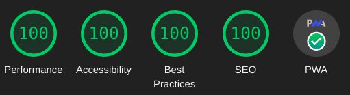

+++
title = "Resumo do site"
description = "Luis-TI.dev.br é um site rápido e leve feito com Zola usando html semântico, um tema CSS abridge de classe-leve, e JS Não Mandatorio."
date = 2024-10-26T15:00:00Z
updated = 2024-10-26T15:00:00Z
draft = false

[taxonomies]
tags = ["Features","Config"]
[extra]
toc = true
series = "Features"
+++

{{ m00main() }}

A fast, lightweight, and modern [Zola](https://getzola.org) theme utilizing [abridge.css](https://github.com/Jieiku/abridge.css) (a class-light semantic HTML CSS Framework). Perfect [Lighthouse](https://pagespeed.web.dev/report?url=abridge.netlify.app), [YellowLabTools](https://yellowlab.tools/), and [Observatory](https://developer.mozilla.org/en-US/observatory/analyze?host=abridge.netlify.app) scores. Here is a [Zola Themes Benchmarks](https://github.com/Jieiku/zola-themes-benchmarks/blob/main/README.md) Page.
<!-- more -->



## Features

- Perfect [Lighthouse](https://pagespeed.web.dev/report?url=abridge.netlify.app), [YellowLabTools](https://yellowlab.tools/), and [Observatory](https://developer.mozilla.org/en-US/observatory/analyze?host=abridge.netlify.app) scores.
- [PWA support](#pwa-progressive-web-app) (Progressive Web Application).
- All JavaScript can be [fully disabled](https://abridge.netlify.app/overview-abridge/#javascript-files).
- Dark, Light, Auto, and Switcher themes. (colors can be customized, css variables)
- Code [syntax highlighting](https://abridge.netlify.app/overview-code-blocks/). (colors can be customized, css variables)
- Numbered code blocks with [line highlighting](https://abridge.netlify.app/overview-code-blocks/#toml).
- Entirely Offline Site by using the PWA **or** by setting `offline = true` in `config.toml` (full search support).
- Multi-language support.
- Search support. ([elasticlunr](https://abridge.pages.dev/), [pagefind](https://abridge-pagefind.pages.dev/), [tinysearch](https://abridge-tinysearch.pages.dev/))
- Search Suggestions navigation keys, `/` focus, `arrow` move, `enter` select, `escape` close.
- Search Results Page, type search query then hit `Enter Key` or `click` the search button icon.
- [SEO](#seo-and-header-tags) support. (Search Engine Optimization)
- [Pagination](#pagination) with numbered paginator on index.
- Title Based Previous and Next Article links at bottom of Article.
- Table of Contents in page Index (Optional, clickable links)
- Recent Posts Block. (Optional)
- Back to Top button. (uses css only)
- Code Blocks copy button.
- Email link in footer obfuscation. (anti-spam)
- [KaTeX](https://katex.org/) support.
- [Archive page](https://abridge.netlify.app/archive/).
- [Tags](https://abridge.netlify.app/tags/).
- Categories. (similar to Tags, disabled/commented out by default)
- Social icon links in footer.
- Responsive design. (mobile first)
- Video Shortcodes: [Youtube](https://abridge.netlify.app/video-streaming-sites/overview-embed-youtube/), [Vimeo](https://abridge.netlify.app/video-streaming-sites/overview-embed-vimeo/), [Streamable](https://abridge.netlify.app/video-streaming-sites/overview-embed-streamable/).
- Media Shortcodes: [video](https://abridge.netlify.app/overview-rich-content/#video), [img](https://abridge.netlify.app/overview-images/#img-shortcode), [imgswap](https://abridge.netlify.app/overview-images/#imgswap-shortcode), [image](https://abridge.netlify.app/overview-rich-content/#image), [gif](https://abridge.netlify.app/overview-rich-content/#gif), [audio](https://abridge.netlify.app/overview-rich-content/#audio).
- Other Shortcodes: [showdata](https://abridge.netlify.app/overview-showdata/), [katex](https://abridge.netlify.app/overview-math/#usage-1).

## Pagination

You can set the number of home page items by editing `content\_index.md` file and adjusting `paginate_by`

### Footer Social Icons

You should configure which social icons you plan to use. (makes the css file size smaller)

To simply turn them all off you can set `$enable-icons: false` (disables ALL icons, navigation, search, etc.)

Otherwise enable only the icons you need, eg for mail you would set `$icon-mail: true`

You should then disable all the other icons that you do not use.

### Theme for noscript visits

If you have abridge configured to use the switcher mode instead of auto/dark/light, then your site will have a button that allows the visitor to toggle the theme.

If your visitor uses noscript or some other javascript blocking browser addon, then they will be stuck with whatever the configured default theme is for the switcher mode.

To adjust this mode you would set the following two config values in `abridge.scss` **AND** `config.toml`:

```scss
$switcherDefault: "dark",// default nojs switcher mode: dark, light (make sure to also set js_switcher_default in config.toml)
```

```toml
js_switcher_default = "dark" # default nojs switcher mode: dark, light (make sure to also set $switcherDefault in abridge.scss)
```

By default abridge uses dark mode for the switcher, so unless you want to set the default mode to light for nojs/noscript visitors, then you do not need to worry about these settings.

### SEO and Header Tags

You can review the SEO tags in the seo macro located at `templates/macros/seo.html`, all configurable values should be in `config.toml` under `config.extra` or in the content markdown files.

In your post markdown file you should set a title less than 60 characters and a description between 80 and 160 characters in length. The description is what is displayed in search results below the page title. Anywhere that you do not set a page description, the primary site config.description will be used instead.

You should also set page specific keywords unless your keywords defined in config.toml suffice, any keywords that you add to the page are in addition to the ones defined in config.toml, so do not add those same keywords to your page keywords.

You can optionally also set a page specific image for search results by using page.extra.thumbnail. Facebook, Twitter, and OpenGraph Cards are supported (automatic image & description for posted links). OpenGraph recommends 1200 x 630 (1.9:1). Twitter recommends 2:1 for large and 1:1 for small. If you do not set a page specific thumbnail then the banner defined in config.toml will be used instead.

Refer to [overview-images](https://raw.githubusercontent.com/Jieiku/abridge/master/content/overview-images/index.md) for an example:
```md
+++
title = "Image Shortcodes"
description = "Images can be embedded directly using markdown ``, but using a shortcode prevents CLS by explicitly setting the width and height."
date = 2021-05-19
draft = false

[taxonomies]
tags = ["Features","Shortcodes","Images"]
[extra]
toc = true
keywords = "Image, Markdown, Shortcodes, Swap"
thumbnail = "ferris-gesture.png"
+++
```

### KaTeX Math Notation

KaTeX can be used to display complex mathematics, it is a "Fast math typesetting for the web."

You can see a demo on [this page](https://abridge.netlify.app/overview-math/).

For better performance I recommend only enabling math on a [per page bases in your post.md files](https://github.com/Jieiku/abridge/blob/master/content/overview-math.md?plain=1#L11-L13), instead of in your main config.toml file.

### PWA, Progressive Web App

Abridge theme has PWA support. You can install the entire site as an app and have it work offline. To try it out simply use google chrome or your phone and go here: [abridge.netlify.app](https://abridge.netlify.app/)

If using Chrome on desktop then look at the end of the address bar for the install button. On Android you should get a popup to install, you can also install from the 3 dot menu in the top right corner. Once you have the PWA installed, you can go completely offline and you will still be able to browse or search the site!

There is an npm script to generate the file cache list and minification `npm run abridge`. My [netlify.toml](https://github.com/Jieiku/abridge/blob/master/netlify.toml) file automatically runs this npm script during site deployment, so everything is automatic. If Zola was able to template a js file then it might be possible to generate the list of cache files dynamically at build instead of relying on node/npm.

To use a specific list of files instead of all files edit the `pwa_BASE_CACHE_FILES` entry in `config.toml`. If even a single file in the cache list is missing then it wont pre cache the list, so it will only cache as you browse. (If just initially setting up, test with only a couple pages.)

The PWA feature is also easy to disable by simply setting `pwa = false` in `config.toml`

## Performance Optimization

### Javascript files

All javascript can be disabled in `config.toml`:

